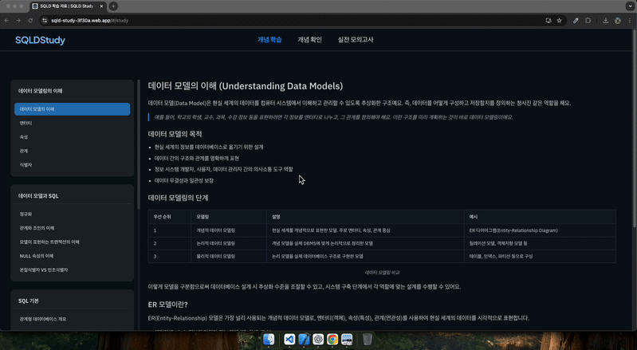
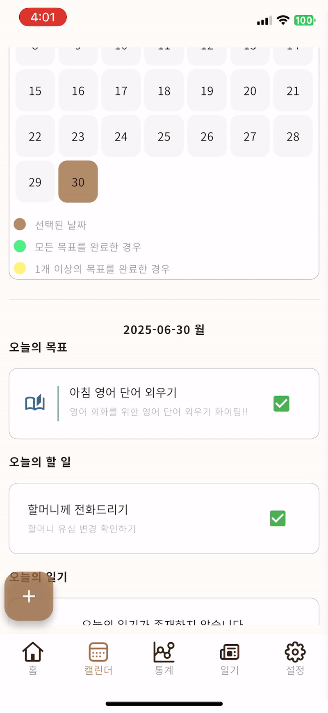

<!-- @format -->

## NOTICE

이 문서는 대표 프로젝트의 하이라이트와 각 프로젝트 README를 연결하는 허브입니다.  
더 깊은 기술 스택, 설계 문서, 회고는 각 디렉터리의 README 및 첨부 자료에서 확인해주세요.

# 👋 안녕하세요! Flutter 개발자 김영준입니다.

Flutter를 중심으로 아이디어를 구체적인 서비스로 구현하는 과정을 즐기며, 
지금까지 5개의 앱 출시와 4회의 외주 프로젝트를 통해 기획부터 개발, 운영까지 전 과정을 경험했습니다. 
현재는 Flutter 개발자로서 기술적 역량을 확장하는 동시에, 풀스택 개발자로 성장하기 위한 기반을 다지고 있습니다. 

## 📫 연락처

📧 Email: [메일 전송하기](devimun909@gmail.com)

💬 KakaoTalk 오픈채팅: [오픈채팅 연결하기](https://open.kakao.com/o/sQLJDl1h)

## 🛠️ 기술 스택

### 📱 Mobile (Front-end)

### 🖥 Web (Front-end)

### 🔙 Backend & Database

### 🎨 Design & Documentation

### 🧠 HOW ABOUT AI

- Codex CLI, Gemini CLI, Claude Code 등 다양한 AI CLI 기반 개발 환경을 활용할 수 있습니다.
- MCP 서버를 직접 구축하여 Figma MCP, TaskMaster AI, Notion MCP 등과 연동한 AI 에이전트 인터페이스 구현 경험이 있습니다.
- Stitch, ReaddyAI 등 디자인 워크플로우 최적화를 위한 AI 디자인 도구를 활용할 수 있습니다.

  

# 대표 프로젝트

## 1. 머니핏

  

### 프로젝트 소개

머니핏은 사용자가 자신의 소비 습관을 쉽게 파악하고 관리할 수 있도록 돕는 가계부 앱입니다. 일일 혹은 월간 예산을 설정해 하루치 자율 지출 한도를 빠르게 확인하고, 캘린더·통계·지출 내역으로 소비 패턴을 한눈에 분석할 수 있습니다.

### 역할

- 기획
- UX/UI 디자인
- 프론트엔드 개발
- Firebase,Supabase 설정 및 연동
- 스토어 배포 전 과정 단독 수행

### 개발 기간: 2025.08 ~ 현재 (1.3.0 기능 개발 진행 중)

### 현재 버전: 1.3.0 (개발 중) / 1.2.5 운영 배포

### 배포 상태:

### 🛠 프로젝트 자료

&nbsp;

&nbsp;

## 2. CosmoFriends - 아케이드 게임

  

### 프로젝트 소개

CosmoFriends는 Flutter Flame 엔진으로 구현한 2D 러닝 아케이드 게임입니다. 무작위로 조합된 커맨드 키를 입력하며 외계인의 추격을 따돌리고, 커스터마이징 가능한 고양이 아바타·보상형 광고·리더보드 등 라이브 운영 기능을 내장했습니다.

### 역할

- 콘셉트 기획
- 게임 에셋 제작
- Flame 기반 Flutter 게임 개발 전 과정 단독 진행

### 개발 기간: 2024.07 ~ 2025.08 (출시 이후 운영 업데이트)

### 현재 버전: 1.1.8

### 배포 상태:

### 🛠 프로젝트 자료

&nbsp;

&nbsp;

## 3. UNUMBERS - 숫자 입력 관리 애플리케이션

| 데스크톱                                               | 모바일                                                |
| ------------------------------------------------------ | ----------------------------------------------------- |
|  |  |

### 프로젝트 소개

UNUMBERS는 10개의 Firestore 문서를 여러 단말이 동시에 제어하는 숫자 입력 관리 도구입니다. Android와 Windows 앱으로 배포되었으며, 데스크탑 앱의 경우, 운영자 계정으로 접속 시 운영자 전용 기능이 내장되어 있습니다.

### 역할

- 계약 기반 기획 검증
- 모바일·데스크톱 앱 개발
- Firebase 백엔드 구축

### 개발 기간: 2024.07 ~ 2025.10 (제작 계약 1회 + 업데이트 계약 3회)

### 현재 버전: 3차 업데이트 빌드 (2025.10)

### 배포 상태: (스토어 미등록)

### 🛠 프로젝트 자료

&nbsp;

---

## 4. SQLD-STUDY - SQLD 자격증 학습 웹사이트

  

### 프로젝트 소개

SQLD 자격증 취득을 위해 제작한 React 기반 학습/문제풀이/모의고사 웹앱입니다. Figma MCP와 Cursor AI 워크플로우를 연결해 디자인-코드 반복을 빠르게 돌렸고, Firebase Hosting으로 간편하게 배포했습니다.

### 역할: UI/UX 설계 · React 개발 · Firebase Hosting 배포

### 개발 기간: 2025.01 ~ 2025.01

### 현재 버전: 1.0.0

### 배포 상태:

### 🛠 프로젝트 자료

## 🚧 현재 진행 중인 프로젝트

### 노력 먹는 돌 - 자기 관리 애플리케이션

| 메인 화면                                  | 캘린더                                         | 구독 및 통계 서비스                            |
| ------------------------------------------ | ---------------------------------------------- | ---------------------------------------------- |
|  |  |  |

### 프로젝트 소개

"노력 먹는 돌"은 루틴, 할 일, 일기, 통계 기능을 제공하며 목표 달성 시 캐릭터가 성장하고 공간을 꾸밀 수 있는 자기 관리 앱입니다. 기획·디자인·프론트엔드 업무를 담당하고 있으며, 백엔드 개발자 1인과 협업 중입니다.

### 역할

- 기획
- 디자인
- 프론트엔드 개발

### 개발 기간: 2024.11 ~ 현재 (베타 테스트 준비)

### 현재 버전: Beta Milestone (개발 50%)

### 배포 상태: 2026.2 정식 출시 목표 / 비공개 클로즈드 베타 운영

### 🚀 주요 기능

- 루틴 및 할 일(To-Do) 관리
- 일기 작성 및 회고 기능
- 통계 시각화 제공
- 캐릭터 성장 및 커스터마이징 시스템
- 멀티 플랫폼 소셜 로그인
- 인앱 결제 및 구독 관리

### 📌 진행 상황

> **개발 50% 진행 / 베타 테스트 준비 중**

- 주요 기능 개발 완료 (루틴, 할 일, 일기, 통계 등)
- 현재 **오류 수정 및 성능 최적화 중**
- 예상 출시일 : **2026.1**
