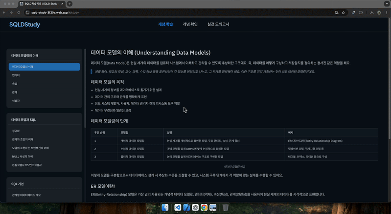
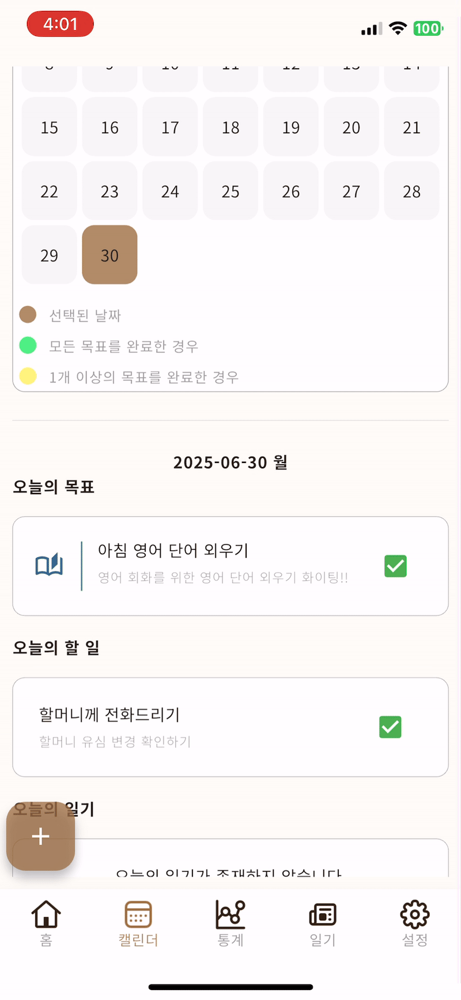
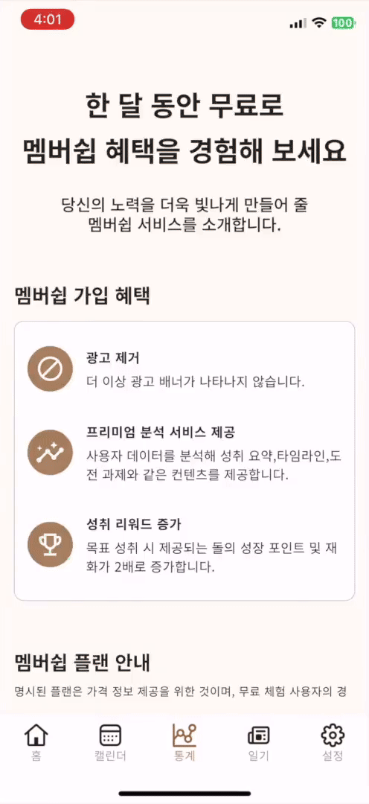

<!-- @format -->

# 👋 안녕하세요! 1인 개발자 김영준입니다.

Flutter를 중심으로 앱 기획부터 디자인, 개발, 배포까지 전 과정을 담당하는 1인 개발자입니다.  
현재는 풀스택 개발자로 성장하기 위해 새로운 기술을 배우고 적용하는 데 흥미를 느끼고 있습니다.

## 📫 연락처

📧 Email: [메일 전송하기](devimun909@gmail.com)

💬 KakaoTalk 오픈채팅: [오픈채팅 연결하기](https://open.kakao.com/o/sKpymrEh)

 

## 🛠️ 기술 스택

### 📱 Mobile (Front-end)

### 🖥 Web (Front-end)

### 🔙 Backend & Database

### 🎨 Design & Documentation

  

## 📱 대표 프로젝트

### 1. CosmoFriends - 아케이드 게임

Flutter의 Flame 게임 엔진을 활용한 2D 아케이드 게임입니다.  
Google Play와 App Store에 정식 출시되었습니다.

  

### 🔗 다운로드

### 🛠 프로젝트 자료

---

### 2. UNUMBERS - 숫자 입력 관리 애플리케이션

외주 요청을 통해 제작된 숫자 입력 관리 애플리케이션입니다.  
Android 앱과 Windows 데스크탑 앱으로 구성되어 있으며, 여러 사용자의 입력 데이터를 효율적으로 통합 관리합니다.

  
    
  

### 🛠 프로젝트 자료

---

### 3. SQLD-STUDY - SQLD 자격증 학습 웹사이트

React 기반으로 제작된 SQLD 자격증 학습 웹사이트입니다.  
Figma AI, Cursor, MCP 서버 등을 활용해 바이브 코딩 방식으로 구현했습니다.

  

### 🌐 웹사이트

### 🛠 프로젝트 자료

  

## 🚧 현재 진행 중인 프로젝트

### 노력 먹는 돌 - 자기 관리 애플리케이션

"노력 먹는 돌"은 일상 속 목표 달성과 자기 관리를 돕는 애플리케이션입니다.  
루틴, 할 일 관리, 일기 작성, 통계 기능을 제공하며, 사용자가 일일 목표를 성취할 때마다 메인 캐릭터가 성장하고 공간을 꾸밀 수 있어 꾸준한 동기부여와 몰입감을 제공합니다.  
노력의 과정을 재미있고 의미 있게 만들어, 지속적인 성장과 자기 발전을 지원하는 앱입니다.

### 협업 정보

프론트엔드 개발자 1인과 백엔드 개발자 1인이 함께 개발 중입니다.

### 📱 Mobile (Front-end)

### 🔙 Backend

### 🔧 기타 서비스

## 데모 화면

### 메인 화면

### 캘린더

### 구독 및 통계 서비스

 

---

### 🚀 주요 기능

- 루틴 및 할 일(To-Do) 관리
- 일기 작성 및 회고 기능
- 통계 시각화 제공
- 캐릭터 성장 및 커스터마이징 시스템
- 멀티 플랫폼 소셜 로그인
- 인앱 결제 및 구독 관리

### 📌 진행 상황

> **개발 70% 진행 / 베타 테스트 준비 중**

- 주요 기능 개발 완료 (루틴, 할 일, 일기, 통계 등)
- 현재 **오류 수정 및 성능 최적화 중**
- 예상 출시일 : **2025.08**

### 🛠 프로젝트 자료

