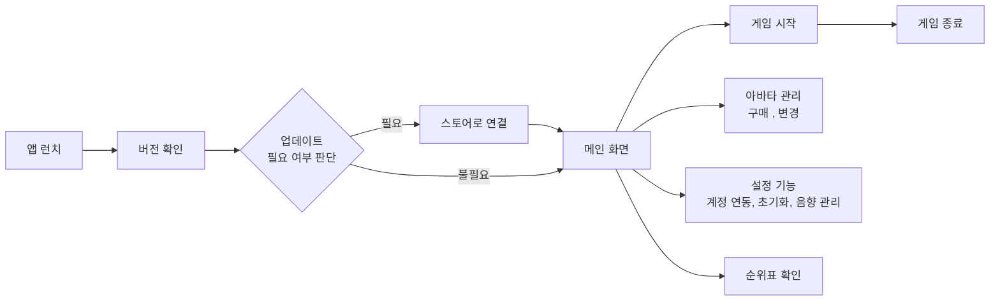

<!-- @format -->

# NOTICE

본 문서는 포트폴리오를 목적으로 작성된 md 파일입니다.
<br>또한 해당 프로젝트는 실제 서비스 중인 앱으로 보안 목적의 비공개 코드가 존재합니다. <br>비공개 코드의 경우 `파일명_block.dart`형식으로 저장되어 있습니다.

```
비공개 코드 내역
// firebase 설정
- lib/firebase_options_block.dart
- lib/game/services/auth_service_block.dart
// admob 광고 ID
- lib/game/widgets/ad_banner/data_block.dart
```

# Cosmo Friends

<p>
  
</p>

Flutter의 Flame 엔진을 기반으로 제작한 2D 캐주얼 게임입니다.
우주에서 외계인이 플레이어를 추격하는 설정으로, 플레이어는 무작위로 조합된 커맨드키를 올바르게 입력해 외계인의 추격을 따돌리는 것이 목표입니다.

## 1. 핵심 기능

| 기능                  | 설명                                                                           |
| --------------------- | ------------------------------------------------------------------------------ |
| 상태 기반 진행 루프   | 홈 → 플레이 → 엔딩 상태를 관리하며 상태에 맞는 UI, 사운드, 연출을 전환합니다.  |
| 커맨드 퍼즐 생성      | 무작위 입력 패턴을 만들고 올바른 순서로 터치했는지 실시간으로 판별합니다.      |
| 실시간 거리 HUD       | 외계인과 플레이어 간 거리를 스트리밍으로 계산해 미터 단위로 표기합니다.        |
| 점수 · 보상 시스템    | 누적 점수를 코인으로 환산하고 보상형 광고 시청 시 보너스를 지급합니다.         |
| 아바타 변경 기능      | 게임 보상으로 제공된 코인을 활용하여, 아바타를 구매하고 적용할 수 있습니다.    |
| 리더보드 및 운영 기능 | 상위 100위 랭킹, 계정 연동, 리뷰 요청, 계정 삭제, 사운드 토글 등을 제공합니다. |

## 2. 사용 흐름

아래 플로우차트는 실행부터 종료까지의 플레이 단계를 간단하게 요약합니다.



## 3. 기술 스택 & 아키텍처

- **클라이언트**: Flutter, Flame, Riverpod, FlameAudio, SharedPreferences
- **백엔드/서비스**: Firebase Auth, Firestore, Cloud Functions, Crashlytics, Analytics
- **운영/유틸리티**: Google/Apple Sign-In, Google Mobile Ads, Connectivity Plus, Package Info Plus, Restart App, URL Launcher, Flutter EasyLoading

## 4. 폴더 구조

주요 디렉터리는 아래와 같으며, 게임 루프/서비스/UI를 명확히 분리하는 것을 목표로 합니다.

```text
lib/
├── main.dart
├── splash_screen.dart
├── firebase_options_block.dart
├── config/
│   ├── data.dart
│   └── style.dart
├── provider/
│   ├── game_provider.dart
│   ├── sound_mange_provider.dart
│   └── user_management_provider.dart
└── game/
    ├── game.dart
    ├── components/
    ├── services/
    └── widgets/
```

- `lib/config`: 전역 상수·스타일·데이터 시드 등 공통 설정을 보관합니다.
- `lib/provider`: Riverpod 기반 상태 관리 모듈로, 사운드·게임·유저 관련 상태를 제공합니다.
- `lib/game/services`: 인증, 버전 체크, 원격 데이터, 로컬 저장소 등 런타임 서비스를 캡슐화합니다.
- `lib/game/components`: 플레이어/외계인, 배경, 애니메이션과 공통 엔진 컴포넌트를 정의합니다.
- `lib/game/widgets`: 게임 상태별 오버레이 UI, 광고 배너, 설정 패널 등 Flutter 위젯 레이어를 모읍니다.

## 5. 기술적 하이라이트

| 항목            | 설명                                                                                                                                                                  |
| --------------- | --------------------------------------------------------------------------------------------------------------------------------------------------------------------- |
| 난이도 관리     | 정답을 맞춘 경우, 외계인이 추격하는 속도를 높여 게이머의 몰입도가 떨어지지 않도록 설계했습니다.                                                                       |
| 로딩 파이프라인 | Firebase Function을 통해 확인해 점검 여부·필수 업데이트를 안내합니다.                                                                                                 |
| 음향 관리       | 배경음과 효과음을 통합 매니저로 제어해 상태 전환 시 자연스럽게 교체하며, 오디오 풀을 활용해 프레임 드롭을 방지했습니다.                                               |
| 네트워크 관리   | 네트워크 연결 상태 스트림을 구독하여 네트워크 장애 발생 시 게임이 일시 정지 되도록 설계했습니다. 이를 통해 서버와 로컬 데이터 간의 불일치 문제를 사전에 방지했습니다, |
| 데이터 동기화   | 로컬 캐시와 Firebase 익명 인증을 기본으로 사용하고, Google/Apple 계정 연결 시 재인증·데이터 머지를 직렬화해 충돌을 방지했습니다.                                      |
| 운영 도구       | 리더보드, 리뷰 요청, 계정 삭제, 사운드 토글, 공지·점검 안내 등 라이브 운영 기능을 내장했습니다.                                                                       |
| 수익화          | 상단 배너와 게임 종료 시 보상형 광고를 배치하고, 1시간 당 최대 5번의 광고를 볼 수 있도록 관리했습니다.                                                                |

## 6. 주요 업데이트

| 버전  | 날짜       | 주요 변경 사항                   |
| ----- | ---------- | -------------------------------- |
| 1.1.8 | 2025-08-27 | 코드 개선                        |
| 1.1.3 | 2025-06-16 | 외계인 이미지 변경, 기존 UI 개선 |
| 1.1.2 | 2025-06-11 | IOS 버전 추가                    |
| 1.1.0 | 2024-11-30 | 리더보드 기능 추가               |
| 1.0.0 | 2024-11-15 | 최초 출시                        |
