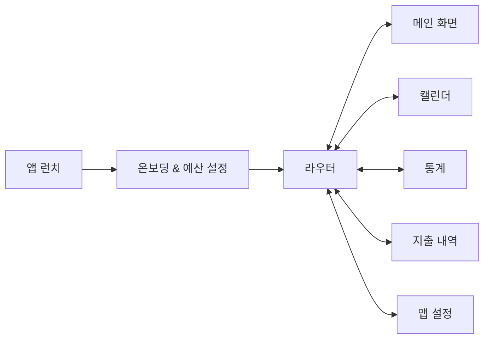
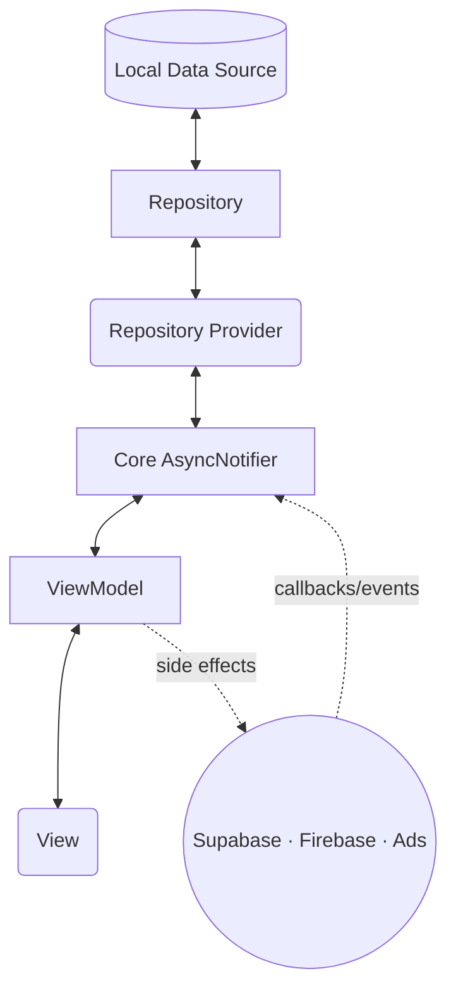

<!-- @format -->

# NOTICE

본 문서는 포트폴리오 공유를 목적으로 작성된 README입니다.  
MoneyFit 앱에는 결제·광고·원격 구성 키 등 비공개 리포지토리가 존재하며, 해당 자격 증명은 저장소에서 제외되었습니다.  
비공개 파일은 `*_block.dart` 형식으로 별도 보관되며, 공개 저장소에는 빈 셸과 주석만 포함됩니다.

```
비공개 코드 내역
- lib/firebase_options_block.dart           // Firebase 프로젝트 키·앱 ID·스토리지 버킷 등 자격 증명 보호
- lib/core/services/ad_service_block.dart   // Google AdMob 광고 단위/앱 오픈·전면 광고 ID 보안 유지
```

또한 개발 과정에서 학습한 내용과 시행착오를 기록한 `docs/log/*.md` 파일과<br>
업데이트 내역 및 계획을 담은 `docs/update/*` 파일이 포함되어 있습니다.

# MoneyFit

<p>
  
</p>

MoneyFit은 사용자가 자신의 소비 습관을 쉽게 파악하고 관리할 수 있도록 돕는 가계부 앱입니다. 일일/월간 예산을 설정하고 자율 지출 가능 금액을 즉시 확인하며, 캘린더·통계·지출 내역을 통해 패턴을 한눈에 살펴볼 수 있습니다.

## 1. 핵심 기능

| 기능        | 설명                                                                                                                                         |
| ----------- | -------------------------------------------------------------------------------------------------------------------------------------------- |
| 온보딩      | 초기 화폐 단위와 일일·월간 예산, 월간 자율 지출 목표를 설정하며 앱 사용 전 필요한 데이터를 로컬에 안전하게 준비합니다.                       |
| 홈 대시보드 | 오늘/이번 달 지출 현황을 원형 게이지로 시각화하고, 월평균 변동 지출·연속 목표 달성일·오늘의 지출 요약·빠른 지출 등록 바텀 시트를 제공합니다. |
| 캘린더      | 날짜별 성공/실패 배지와 필수/자율 지출 합계를 표시하고, 월간 통계 패널과 일별 상세 내역을 바텀 시트로 제공합니다.                            |
| 통계        | 월간 카테고리별 파이차트, TOP3 지출, 월 전환 시 즉시 재계산되는 지표를 제공해 소비 패턴을 다각도로 분석합니다.                               |
| 지출 내역   | 월간 전체 지출을 수직 스크롤로 조회하고, 유형/카테고리/정렬 필터 및 바텀 시트 입력 폼으로 CRUD를 처리합니다.                                 |

## 2. 사용자 흐름

아래 플로우차트는 뷰의 흐름을 간단하게 요약합니다.



## 3. 기술 스택 & 아키텍처

- **클라이언트**: Flutter 3.8, Riverpod, GoRouter, Intl, Flutter Local Notifications, fl_chart, Flutter Phoenix
- **데이터/백엔드**: SQLite(`sqflite`), Supabase, Firebase (Core/Analytics/Remote Config)
- **운영/성장 도구**: Google Mobile Ads, NotificationService, ReviewPromptService, Firebase Analytics Observer
- **아키텍처**: Feature-first MVVM + 계층형 저장소 구조로 `Database → Repository → RepositoryProvider → Core AsyncNotifier → Feature ViewModel → View` 순서대로 데이터가 전달되고, 외부 서비스는 ViewModel에서 사이드 이펙트로 주입됩니다.



## 4. 폴더 구조

폴더 구조는 Feature-first 형식의 MVVM 패턴을 적용시켰습니다.

```text
lib/
 ├── core/          # 공통 인프라 (DB, 서비스, 라우터, 테마, Provider)
 |    ├── database
 |    ├── repositories
 |    ├── provider
 ├── features/      # 도메인 모듈 (home, calendar, expense, statistics, settings…)
 │    ├── view/
 │    ├── viewmodel/
 │    └── model/
 └── widgets/       # 전역 위젯 (탭바, 다이얼로그 등)
```

- `core/`: DatabaseHelper, Repository 추상화, AppInitializer, Ad/Notification/Review 서비스 등 크로스커팅 로직을 제공합니다.
- `features/`: Feature-first 구조에서 각 도메인이 **View** · **ViewModel** · **Model** 3단계로 구성됩니다. View는 ProviderScope에서 상태만 구독하고, ViewModel이 비즈니스 로직을 담당해 테스트와 리팩토링을 독립적으로 수행할 수 있습니다.
- `widgets/`: 탭바, 공통 바텀 시트, 다이얼로그 등 재사용 가능한 프레젠테이션 컴포넌트를 모듈과 분리해 유지보수를 단순화합니다.

## 5. 기술적 하이라이트

| 항목                          | 설명                                                                                                                                                                                                                                                       |
| ----------------------------- | ---------------------------------------------------------------------------------------------------------------------------------------------------------------------------------------------------------------------------------------------------------- |
| 상태 관리 & 캐싱              | ViewModel이 월별 지출 Map을 캐싱하고, 홈·캘린더·통계가 동일한 날짜 컨텍스트를 공유해 불필요한 쿼리를 줄입니다.                                                                                                                                             |
| Feature-first MVVM            | 폴더 구조를 기능 단위로 모듈화하였고, MVVM(model - viewmodel - view) 디자인 패턴을 적용하여 각 계층별 독립성을 확보하였습니다.                                                                                                                             |
| 계층형 데이터베이스 관리 구조 | `DatabaseHelper → Repository → RepositoryProvider → Core AsyncNotifier` 로 이어지는 계층 구조를 통해 데이터 접근과 상태 관리를 일관성 있게 통합하여. 데이터 소스 교체나 동기화 확장 시에도 상위 레이어(ViewModel·UI) 변경 없이 대응이 가능하도록 했습니다. |
| 로컬/원격 병행 저장소         | SQLite Singleton과 Repository 추상화로 CRUD를 처리하면서, Supabase 익명 로그인/문의 저장소를 병행해 향후 동기화 전략 확장을 대비했습니다.                                                                                                                  |
| 로컬라이제이션                | `l10n` + 다국어 카테고리 Provider로 한국어/영어/필리핀어/말레이시아어 UI를 제공하여 다양한 국적의 사용자를 지원합니다..                                                                                                                                    |

## 6. 주요 업데이트

| 버전  | 기간/일자 | 주요 변경 사항                                                                                                                            |
| ----- | --------- | ----------------------------------------------------------------------------------------------------------------------------------------- |
| 1.0.0 | 25.08.04  | 최초 출시일                                                                                                                               |
| 1.1.1 | 25.08.09  | 다국어(KO/EN/PH/MY) 지원, 알림 수신 오류 수정, UI 개선, 업데이트 관리 시스템, 불필요 소수점 제거, 지출 수정 오류 및 캘린더 날짜 표시 개선 |
| 1.2.0 | 25.08.31  | 통계 페이지 추가, 업데이트 안내 문구 지원, 광고 로직 개선                                                                                 |
| 1.2.1 | 25.09.01  | 파이차트 색상 개선, 기본 카테고리 추가, 통계 코드 리팩토링, 필수 지출 존재 시 통계 표시 오류 및 파이차트 텍스트 가독성 문제 해결          |
| 1.2.2 | 25.09.08  | 메인·온보딩·설정에서 월간 자율 지출 금액을 설정/확인할 수 있는 기능 추가                                                                  |
| 1.2.3 | 25.09.10  | 사용자 문의 기능 추가                                                                                                                     |
| 1.3.0 | (진행 중) | 메인 테마 변경 기능 추가 예정, 온보딩 제거·메인 튜토리얼 간소화, 테마 코드 일관성 개선, 폴더 구조 및 전반 리팩토링                        |
