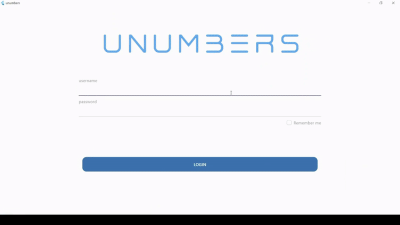
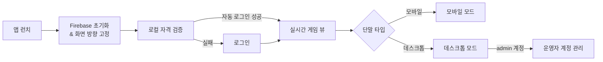

<!-- @format -->

# NOTICE

본 문서는 포트폴리오 공유를 목적으로 작성된 README입니다.  
MoneyFit 앱에는 결제·광고·원격 구성 키 등 비공개 리포지토리가 존재하며, 해당 자격 증명은 저장소에서 제외되었습니다.  
비공개 파일은 `*_block.dart` 형식으로 별도 보관되며, 공개 저장소에는 빈 셸과 주석만 포함됩니다.

```
비공개/대체 코드 내역
- lib/firebase_options_block.dart     // Firebase 프로젝트 키 및 앱 등록 정보
- lib/feature/login/login_block.dart  // 실 서비스 로그인 UI/프로세스를 대체한 포트폴리오 전용 위젯
```

# UNUMBERS

| 데스크톱                                                | 모바일                                                 |
| ------------------------------------------------------- | ------------------------------------------------------ |
|  |  |

UNUMBERS는 10개의 숫자 문서를 여러 단말에서 동시에 운영하는 실시간 숫자 관리 도구입니다.  
모바일에서는 넘버 패드 기반 단일 문서 입력을, 데스크톱에서는 최대 4개의 문서를 한 화면에서 제어하는 콘솔 UX를 제공합니다. Firestore를 SSoT로 사용하며, 운영자는 내장 계정 관리 툴을 통해 사용자 권한을 실시간으로 유지보수할 수 있습니다.

## 1. 핵심 기능

| 기능                    | 설명                                                                                                                                    |
| ----------------------- | --------------------------------------------------------------------------------------------------------------------------------------- |
| 멀티 도메인 실시간 구독 | Firestore 단일 문서를 스트림으로 구독하여 10개 게임/문서 상태를 동시에 수신하고, 뷰 계층은 파생 상태만 구독해 렌더 횟수를 최소화합니다. |
| 입력 권한 선점/반납     | 각 문서에 입력자 필드를 두고 선점·해제를 서비스 계층에서 일괄 처리하여 다중 단말 간 충돌을 예방합니다.                                  |
| 모바일 넘버 패드        | 햅틱·사운드 피드백이 포함된 전용 넘버 패드와 문서 전환 버튼을 제공하며, 권한이 없을 때는 오버레이로 입력을 차단합니다.                  |
| 데스크톱 콘솔           | 4분할 레이아웃에서 각 패널이 독립적으로 문서를 선택하고, 키보드 단축키(Enter/→/Delete)로 배치 입력·삭제를 실행합니다.                   |
| 대시보드 & 존 뷰        | 입력 시퀀스를 구역별로 파싱해 거리 기반 컬러 코드를 적용하고, 자동 스크롤 대시보드로 최신 입력을 항상 노출합니다.                       |
| 운영자 계정 관리        | Admin 계정 전용 페이지에서 Firestore `users` 컬렉션을 실시간으로 조회·생성·삭제하며, 동일한 로딩 스피너와 테마를 재사용합니다.          |
| 자동 로그인             | SharedPreferences에 저장된 자격 정보로 앱 시작 시 자동 로그인을 시도하고, 유효하지 않을 경우만 로그인 화면을 노출합니다.                |

## 2. 사용자 흐름



## 3. 기술 스택 & 아키텍처

- **클라이언트**: Flutter 3.x, Dart 3.4, GoRouter, Flutter EasyLoading, AutoSizeText, SharedPreferences, Audioplayers
- **상태 관리**: Riverpod (StateNotifierProvider, StreamProvider, StateProvider) 기반 DI + 로딩 오버레이 전역화
- **실시간 백엔드**: Firebase Core, Cloud Firestore (단일 도큐먼트 기반 스트림, 입력자 잠금 필드, 누적 시퀀스 배열)
- **플랫폼 기능**: SystemChrome(세로 고정), HapticFeedback, KeyboardListener/FocusNode, Platform Channel(모바일/데스크톱 모드 분기)
- **운영 도구**: Firestore 기반 사용자 관리, SharedPreferences 계정 캐시, Flutter EasyLoading 로딩 상태 공통 처리
- **아키텍처**: Feature-first 레이아웃 + 서비스 계층(공용 Firestore 래퍼) + 모델 계층(도메인 전용 파서)으로 UI·도메인·인프라를 분리

## 4. 폴더 구조

```text
lib/
├── main.dart                 # 앱 엔트리, Firebase 초기화, ProviderScope 부트스트랩
├── router/router.dart        # GoRouter 설정 및 MainLayOut 래퍼
├── firebase_options_block.dart
├── feature/
│   ├── home/                 # 자동 로그인 & 초기 진입 라우팅
│   ├── login/                # 포트폴리오 버전 로그인 위젯 및 상태
│   ├── stream/               # Firestore 스트림 Provider와 모델 변환
│   ├── game/
│   │   ├── game_view.dart    # 단말 타입 감지 후 모바일/데스크톱 뷰 선택
│   │   ├── desktop_mode/     # 4분할 콘솔, 입력창, 버튼 위젯, Provider
│   │   ├── mobile_mode/      # 넘버 패드, 문서 전환, 모바일 입력 파이프라인
│   │   └── game_share/       # 공통 모델/위젯/상태(대시보드, 존 뷰, 로딩 등)
│   ├── user_management/      # 운영자 전용 계정 생성/목록 관리 UI
│   └── utils/                # Firestore 서비스, enum, 컬러 계산, 스타일 테마
└── cosmo_README.md ...       # 기타 포트폴리오 문서
```

- **공통 레이어**: `feature/game/game_share`는 모바일/데스크톱이 공유하는 위젯·모델을 모아 UI 중복을 제거합니다.
- **서비스 추상화**: `feature/utils/firestore_share.dart`는 모든 Firestore 명령을 단일 서비스로 묶어 UI에서 데이터 소스에 직접 접근하지 않도록 합니다.
- **플랫폼 별 UI**: `desktop_mode`와 `mobile_mode`는 입력 UX, 레이아웃, 제스처 처리를 각각 최적화하고, Provider를 통해 상태만 공유합니다.

## 5. 기술적 하이라이트

| 항목                       | 설명                                                                                                                                                     |
| -------------------------- | -------------------------------------------------------------------------------------------------------------------------------------------------------- |
| Firestore 단일 스트림 SSOT | 10개 문서를 하나의 도큐먼트로 묶고 `StreamProvider`가 이를 전역 상태로 노출하여, 모든 화면이 동일한 스냅샷을 기준으로 파생 상태를 계산합니다.            |
| 권한 기반 동시 편집 제어   | 입력창 포커스·넘버 패드 액션 전에 Firestore 락 필드를 검사/갱신해 다중 단말 입력 충돌을 방지하고, 권한 변경 시 다른 단말의 포커스를 자동 해제합니다.     |
| 키보드 자동화 & 배치 입력  | 데스크톱 입력창은 KeyboardListener와 FocusNode를 결합해 Enter/→ 키 입력을 Firestore 업데이트로 직결하고, 공백 구분 숫자를 파싱해 다건 삽입을 지원합니다. |
| 거리 기반 컬러 파이프라인  | 입력 시퀀스를 구역별로 재구성하고, 직전 값과의 원형 거리 계산 결과에 따라 색상을 매핑해 패턴을 즉시 시각화합니다.                                        |
| 공통 로딩/알림 UX          | Riverpod StateProvider 기반 로딩 스피너와 SnackBar 피드백을 공유 위젯에 주입하여, 모바일·데스크톱/운영 툴 전반에서 일관된 UX를 유지합니다.               |
| 운영자 실시간 툴           | Firestore 계정 컬렉션을 스트림으로 구독하여 생성/삭제가 즉시 반영되고, 동일한 테마와 입력 컴포넌트로 관리 툴을 구축했습니다.                             |

## 6. 주요 업데이트

| 단계         | 기간              | 주요 내용                                                                                      |
| ------------ | ----------------- | ---------------------------------------------------------------------------------------------- |
| 최초 개발    | 2024.07 ~ 2024.07 | 실시간 숫자 입력 MVP, 모바일/데스크톱 분기, Firestore 단일 문서 구조 확립                      |
| 1차 업데이트 | 2025.05 ~ 2025.05 | 데스크톱 4분할 콘솔 고도화, 배치 입력·키보드 단축키, 색상 규칙 개편 , 문서 구조 변경 , UI 변경 |
| 2차 업데이트 | 2024.07 ~ 2025.08 | 모바일 HUD/넘버 패드 UX 개선, 진동·사운드 피드백, 자동 스크롤 대시보드 도입 , UI 변경          |
| 3차 업데이트 | 2024.09 ~ 2025.10 | 운영자 계정 관리, Firestore 락 로직 및 자동 로그인 개선, 로딩 UX 통합                          |
